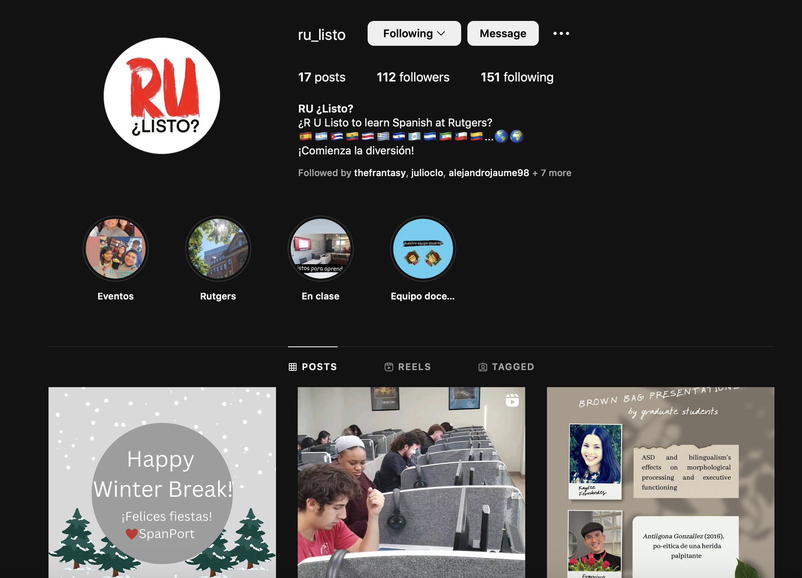

# Outline

- What's new

- For the future

---

# Outline

- **What's new**

- For the future

---

# What's new

(Not much)

- Promotion of the program 

  - Instagram

  - stickers 
  
- Slack channel

- Mental Health check-ins

---

# Whats new 

- Follow us: 

---
# Whats new 

## How you can contribute to Instagram:

- Want to promote your research? 

- Think there is a student who deserves recognition? 

- Are you doing something cool in your classes? 

Let us know! We can post about it. 

---
# Samples: 

---
# Whats new 

## How you can contribute to Instagram:

- We are planning to post things like: 

  - "Where they are Wednesdays" - Alumni feature, how they are using their Spanish, what was their favorite part of the department, etc. 
  
  - Faculty spotlight - share research, presentations, publications, class promotion on instagram page 
  
  - Department events - already posting these
  
  - Major/minor spotlight: 
  
**If you have something you want to share related to anything above (or not related, you can share anyway), please email me!**

---
background-image: url("libs/img/stickers.png")
background-size: contain

# We also have stickers (I have to order more lol)

---
# What's new 

## Slack channel 

- A channel for instructors to share resources (videos, readings, etc) and events on campus that could be of interest for students. 

- If you want to join: https://join.slack.com/t/spanport/shared_invite/zt-1ntefejfo-mTZMCNyI2Kk9iPPbg25tNQ 

---
# What's new 

## Mental health check-ins

- Working with Faculty/Staff Counseling resources to put on a series of workshops for TAs/GAs (or anyone else interested!) about managing time, work-life balance, coping mechanisms, etc. 

- It's free! (bc we're Rutgers employees)

- I will send an announcement for the first workshop (hopefully end of February, early March)

---
# Outline

- What's new

- **For the future**

---
# For the future 

- We currently use 2 textbooks, which is a bit annoying logistically

  - we are using both Pearson and VHL central

- Ideally we should be using one from 101-132 (students would also appreciate this so that they don't have to purchase more than one)

- There are are a lot of options to choose from with either publisher, or we can go a different route completely.

---
# For the future

- Things to consider before making any changes: 

  - A book that can be easily adapted for all levels of Spanish
  
  - One that isn't too pricey (a large number of cases recently of financial issues and not being able to afford textbooks)
  
  - If we choose a textbook that doesn't have online workbooks (like the current system does), syllabi would have to be reworked or assignments would have to be standardized and made to fill in for that in the grade breakdown 
  
---
# For the future 

- A push for more community-based projects and work as a part of the language program

- Ideas: 

  - Conversation cafés (open to not only majors and minors, but anyone who is interested in practicing Spanish who we can hopefully convince to take our classes if they come)
  
    - possibility of opening this up to the community as a language exchange (our students could help with their English and they could help our students with Spanish) (consider contacting: https://gse.rutgers.edu/about/local-and-global-partnerships/local-partnerships/conversation-tree/ )

  - Rutgers Day program: TAs and I are currently brainstorming ideas of how the language program can contribute and make the event/our table more fun 
  
  - Using the language lab for more than just exams: thoughts?
  
---
class: middle, center, inverse

# Thanks :)
